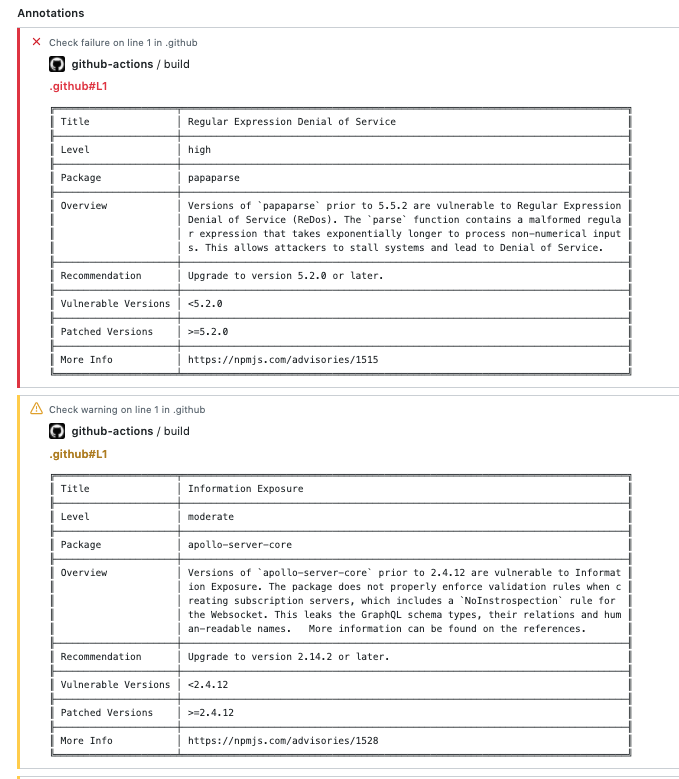

# npm-audit-action


Automatically create npm audit result annotations when running in Github Actions

## Inputs

- `dirPath`

   Directory path of the project to audit
(Defaults current directory)

- `sort`

   Sort output audits ascending from least to most serverity or descending from most to least severity.

  Options:

      asc - (String) Ascending severity low to high
      dsc - (String) Descending severity high to low (Default)

- `debug`

  Whether to output logging of action running.
(Default false)

## Usage

```yaml
name: Audit Action
on: [push]
jobs:
  audit_action_job:
    runs-on: ubuntu-latest
    name: A job to test audit action 
    steps:
      - uses: actions/checkout@v2
      - name: Use the action
        uses: meroware/npm-audit-action@v1.0.2
        with:
           dirPath: vulnerable-project
```

## Outputs



## Contributing

TBD

## License

Licensed under [MIT](./LICENSE).
